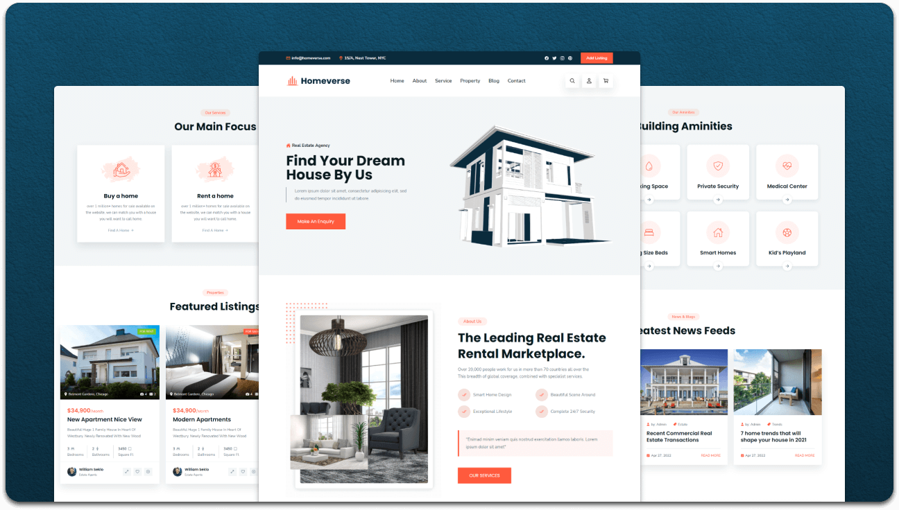

<div align="center">
  
  

  <br />
  <br />
  
  

  <h2 align="center">Homeverse - Real estate website</h2>

  Homeverse is fully responsive Real estate website, <br />Responsive for all devices, built using HTML, CSS, and JavaScript.

  

</div>

<br />

### Demo Screeshots




### Prerequisites

Before you begin, ensure you have met the following requirements:

* [Git](https://git-scm.com/downloads "Download Git") must be installed on your operating system.

### Run Locally

To run **Homeverse** locally, run this command on your git bash:

Linux and macOS:

```bash
sudo git clone https://github.com/fhavy/gabs-homeverse
```

Windows:

```bash
git clone https://github.com/fhavy/gabs-homeverse

### Contact


### License

This project is **free to use** and does not contains any license.
